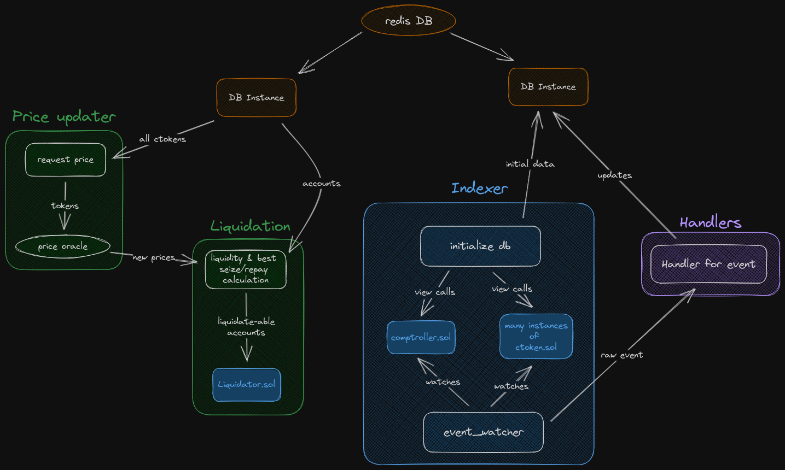
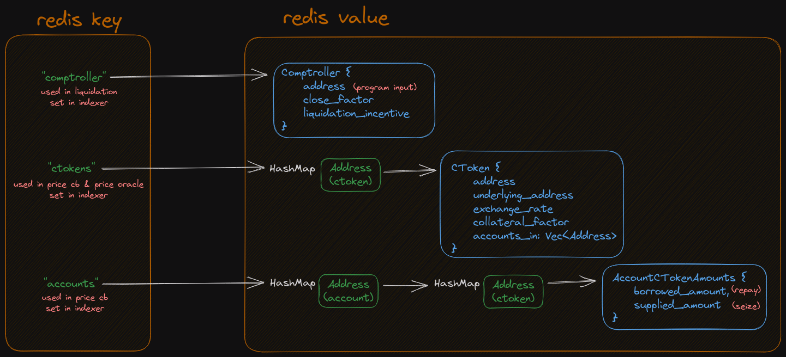

# liquidator_v1

# Architecture
These diagrams are just for my reference, they don't comply to any standard

## Modules

## Database

# Roadmap

## Phase 1: Start
- extremely basic liquidator
- troll chain since protocol creation and find market enter/exits
    - start a process for present and past blocks
- call to liquidator smart contract
- Only CERC20, not bothering with CEther for now because we only care about L2s

TODO: handle newComptroller event
TODO: Where could I assign some sort of
priority to accounts that I should
check for liquidation/ volatile tokens?
TODO: rework readme
TODO: put shit in env
TODO: support dynamic ctoken lists.  currently just getting all ctokens using comp.allMarkets, so this bot is unaware of new markets added
TODO: make comptroller creation block a dynamic binary search
TODO: allow for either Https or websocket connections

## Phase 2: Correct
- proper error handling
- store positions in redis.  Use the more simple approach of serializing/deserializing entire data structures
- use a better price oracle.  Coingecko rate limit is like 10/minute
- If db instance is wrapped in arc mutex, do I really need each operation inside of db to be also wrapped in arc mutex?  This slows down everything cause they're all leaning on the one db...
- multicalls!!!!
- TESTS!

## Phase 3: Scale
- run it through a profiler to find bottlenecks
- using get_logs or get_logs_paginated might be more efficient than query
- Determine smallest accurate amount of current users.  Phase 1 just took all users who entered a market, but we could also maybe use marketExited to find out which users are still around
- make the redis db secure (close ports?)
- use complex redis data structures to represent data instead of serializing/deserializing every time
- use redis ahash (+7-10% performance)
- multithread
    - split account and ctoken updating into their own threads
- better logging than println
- batching RPC calls (multicall)
- websocket instead of https for performance (maybe no.  End goal is to be on IPC anyways)
- Confirm the fastest way to get chain data: API, theGraph, or custom indexer
- execute multiple liquidate calls at once based on close factor
- find a faster serializer: https://github.com/djkoloski/rust_serialization_benchmark
    - don't need if we switch to approach of using complex redis data structures for everything

## Phase 4: Spread
- script to deploy onto any lending protocol and fork
- function to find the comptroller contract creation block for each protocol
- Add abstraction for any evm chain
- target small lending protocols with not much competition

## Optional Phase: Data
- add events to Liquidator contract to keep track
- dune dashboard to track stats from all my deployed bots

## Phase 5: Big
- suit up to be competive on large lending protocols
- my own ethereum/OP/ARB/etc nodes
- switch to IPC for even faster speeds
    - https://www.gakonst.com/ethers-rs/providers/ipc.html
- private flashbot mempool submitting transactions directly to miners
    - https://docs.flashbots.net/

## Refactor to alloy when alloy is done

To research: On L2s where gas is very cheap, constantly create new accounts and call entermarket call.  On accounts creation send address to bot and bot filters out that address.  Possibly clogs up competitor liquidators.  Might not be worth it for the gas fees and good liquidation bots might have a safeguard against this.

# Sources
 - https://www.comp.xyz/t/the-compound-iii-liquidation-guide/3452