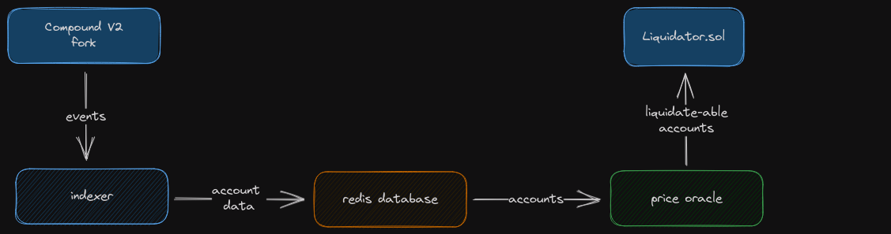

# liquidator_v1
VERY MUCH NOT DONE.  I'm just making this public at this point to show that I have indeed been building and learning.

It's been fun learning by doing.

## What
A generic liquidator bot that can be deployed on any Compound V2 forks.
Liquidate-able accounts are liquidated via flashloan, allowing me to liquidate an account of any size.

## Why
I wanted to learn Rust and I enjoy thinking about performance.  I thought this would be a fun optimization project and the best way to learn a new tool is to use it.

Compound V2 is one of the most forked lending protocols and I noticed that many Compound V2 forks by smaller protocols actually had to build their own internal liquidator bot because their protocol wasn't discovered by larger bots.  This bot is aimed at being easily deployed onto any Compound V2 fork.

# Architecture

## Database

# Big TODO board
This isn't updated regularly, I just dump things here while I'm working on other things so I don't forget.  But for now I'm just focusing on getting it from 0 to 1.  When something is done I just remove it, so don't expect this to be a dev log.

### smaller items
- make comptroller creation block a binary search.  One less input for me when deploying onto a new fork
- call to liquidator.sol contract
- execute multiple liquidate calls at once based on close factor
- use redis ahash (+7-10% performance)
- better multicall batching
- add events to Liquidator contract

### larger items
- better logging than println
- use a dedicated indexing service instead of building my own
- unit tests
- handle newComptroller event (need to determine if this is worth it)
- support dynamic ctoken lists.  currently just getting all ctokens using comptroller.allMarkets, so this bot is unaware of new markets added
- find a faster serializer: https://github.com/djkoloski/rust_serialization_benchmark

### hopes and dreams
- benchmark environment to race different versions of this bot
- Add some sort of priority to more volatile tokens / tokens with exposure to lots of volatile tokens
- run it through a profiler to find bottlenecks
- notify me of my liquidations
- profit/loss of my liquidations historically
- script to validate fork abi so I can easily deploy onto any fork
- dune dashboard to track stats from all my deployed bots
- big and fast price oracle.  Might cost some money